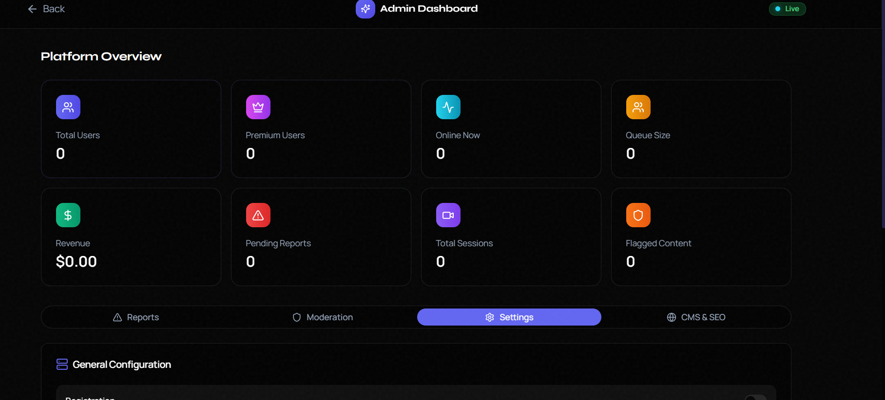
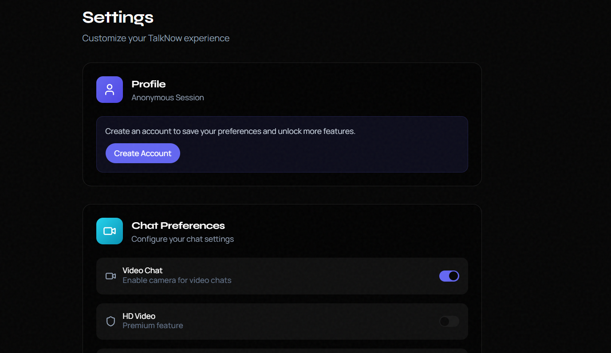
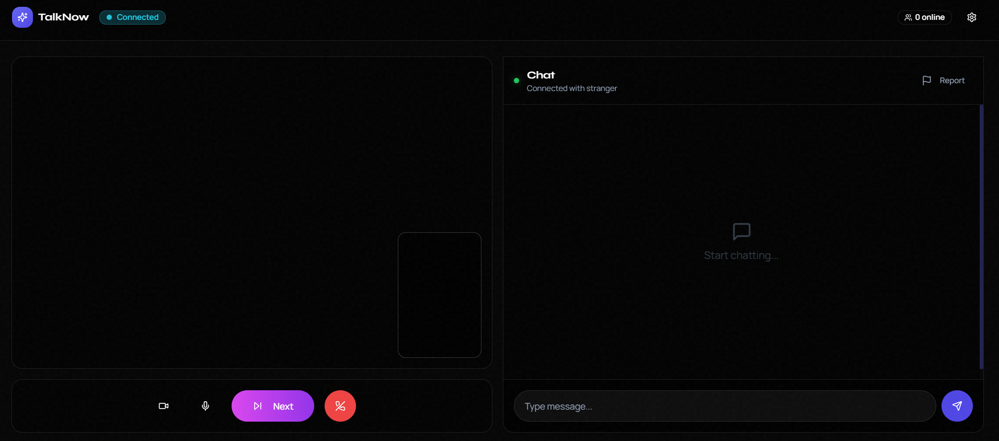
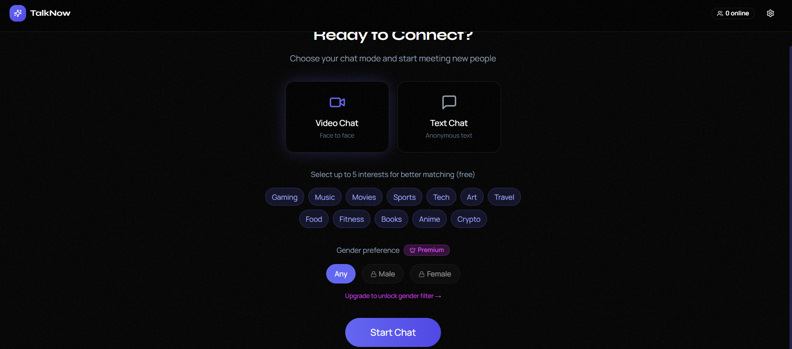
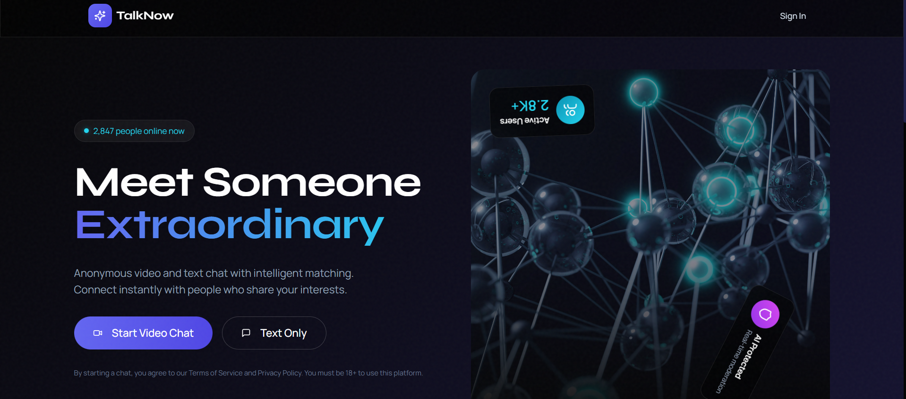

# OmegleXTalkNow

**OmegleXTalkNow** is a modern, full-stack random video chat application inspired by Omegle, enhanced with a comprehensive Admin SaaS platform. Built with **FastAPI** and **React**, it features real-time WebRTC video, WebSocket messaging, AI-powered moderation, and a robust CMS for premium content management.

<div align="center">
  
  
</div>

## 🚀 Key Features

### 🎥 Core User Experience
-   **Random Video Matching**: Instant WebRTC-based video connections with strangers.
-   **Real-time Text Chat**: Low-latency messaging powered by WebSockets.
-   **Anonymous & Secure**: No registration required for guest users; strong privacy controls.
-   **Mobile Optimized**: Responsive design for seamless use on phones and tablets.

### 🛡️ Admin & SaaS Platform
-   **Dashboard Analytics**: Real-time insights into active users, sessions, and revenue.
-   **User Management**: Ban, mute, or promote users; manage reports effectively.
-   **SaaS Settings**: Configure SMTP, API keys, and feature flags directly from the UI.
-   **Content Management System (CMS)**: Create and edit custom pages (e.g., Privacy, Terms) with SEO optimization.
-   **Monetization**: Integrated Stripe payments for premium subscriptions (VIP tiers).

### 🤖 AI & Security
-   **AI Moderation**: Automated text and content moderation capabilities.
-   **Security Hardening**: Rate limiting, CORS protections, and secure headers.
-   **Role-Based Access**: Granular permissions for Admins and Moderators.

---

## 🛠️ Tech Stack

### Frontend
-   **Framework**: [React 19](https://react.dev/)
-   **Build Tool**: [Create React App (CRA)](https://create-react-app.dev/) / Craco
-   **Styling**: [Tailwind CSS](https://tailwindcss.com/) & [Radix UI](https://www.radix-ui.com/)
-   **Icons**: [Lucide React](https://lucide.dev/)
-   **Real-time**: `socket.io-client`

### Backend
-   **Framework**: [FastAPI](https://fastapi.tiangolo.com/) (Python)
-   **Database**: [MongoDB](https://www.mongodb.com/) (via `motor` async driver)
-   **Real-time**: `python-socketio` & WebRTC
-   **AI Integration**: OpenAI & Google Gemini APIs
-   **Payments**: Stripe API

---

## ⚙️ Installation Guide

### Prerequisites
-   **Python** 3.9+
-   **Node.js** 18+
-   **MongoDB** running locally or via Atlas

### 1️⃣ Clone the Repository
```bash
git clone https://github.com/yaratul2005/OmegleXTalkNow.git
cd OmegleXTalkNow
```

### 2️⃣ Backend Setup
Navigate to the backend directory and set up the virtual environment.

```bash
cd backend
python -m venv venv
# Windows
.\venv\Scripts\activate
# Linux/Mac
source venv/bin/activate

pip install -r requirements.txt
```

**Configuration (.env)**:
Create a `.env` file in the `backend` folder:
```ini
MONGO_URL=mongodb://localhost:27017
DB_NAME=talknow
JWT_SECRET=your_super_secret_key_change_this
OPENAI_API_KEY=sk-...
STRIPE_SECRET_KEY=sk_test_...
FRONTEND_URL=http://localhost:3000
```

**Run the Server**:
```bash
python server.py
# Server runs on http://localhost:8000
```

### 3️⃣ Frontend Setup
Navigate to the frontend directory.

```bash
cd ../frontend
npm install
```

**Run the App**:
```bash
npm start
# App runs on http://localhost:3000
```

---

## 📸 Gallery

<div align="center">
  
  
  <br/><br/>
  
  
</div>

---

## 👥 Credits

**Developed by:**

-   **Name**: Yaser Ahmmed Ratul
-   **Country**: Bangladesh
-   **Instagram**: [@i.m.ratul](https://instagram.com/i.m.ratul)

---

## 📄 License

This project is licensed under the MIT License. See the [LICENSE](LICENSE) file for details.
